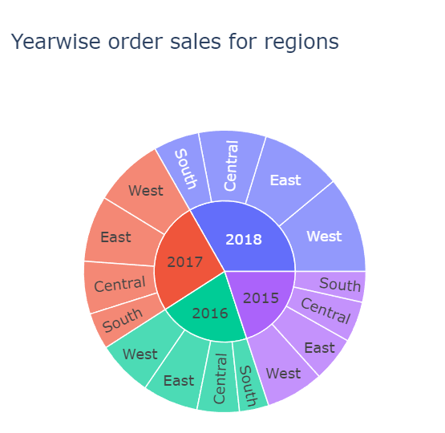
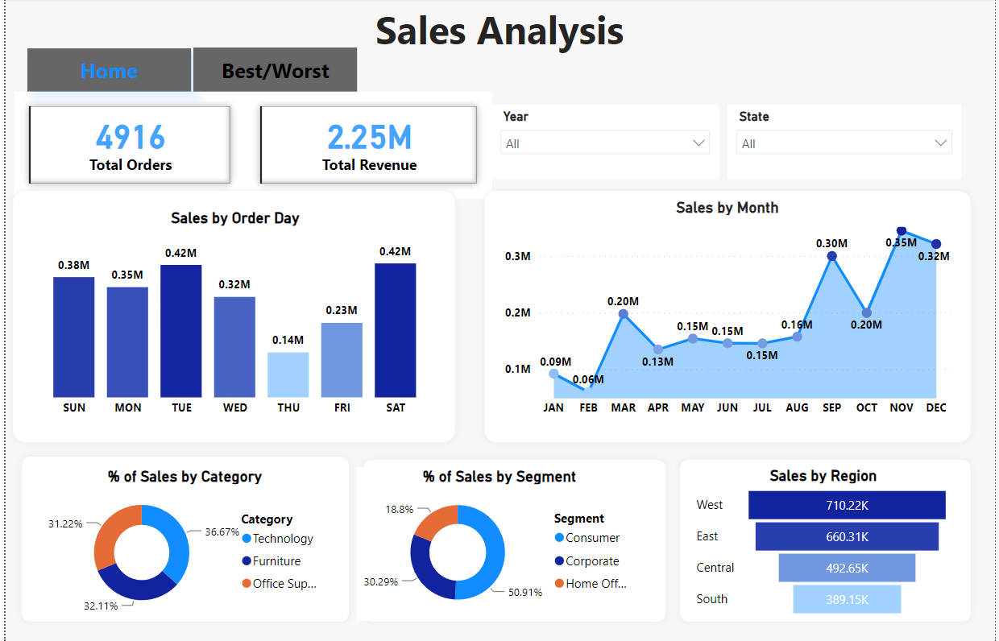
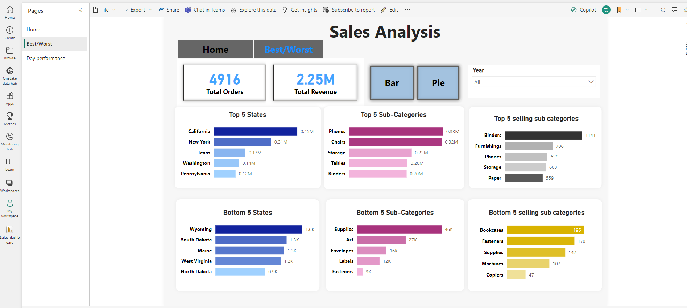
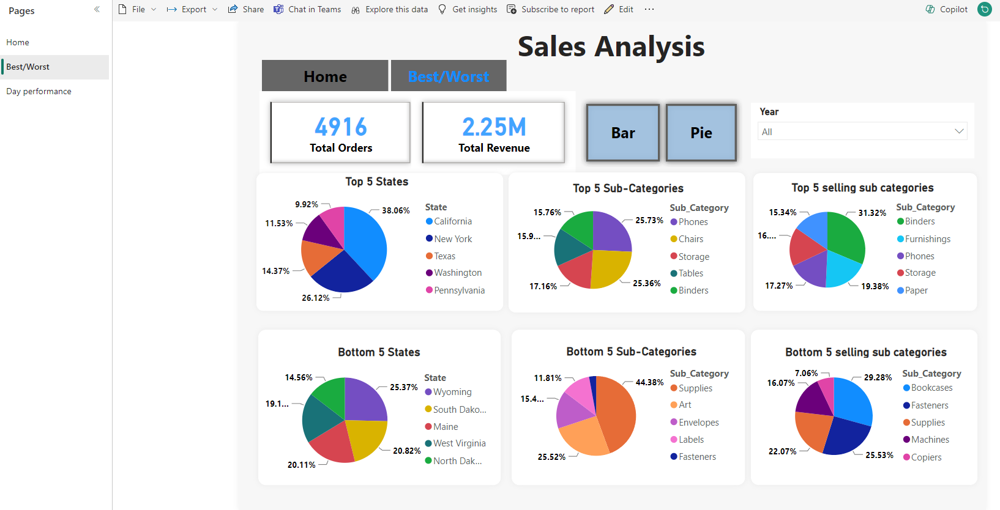
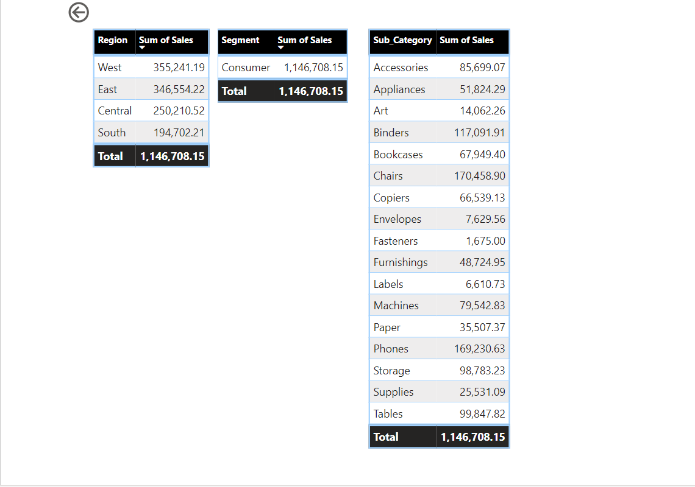
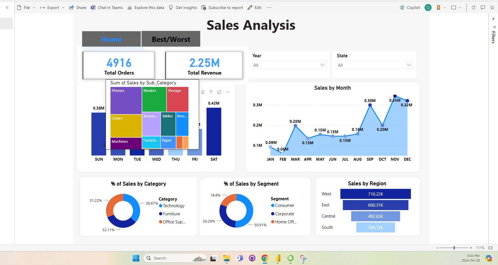

# Sales Analysis
The ultimate goal of this project is to create PowerBI dashboard.

## Steps 
The first step involved was to extraxt and clean the datatset. This was doone using Python and SQL. Refer here for [cleaning](https://github.com/RimpleDabas/Sales_Analysis/blob/main/Sales_cleaning.ipynb) steps.Exploratory data analysis was done in Python to get some insights. For eg. Sunburst chart below shows the best performing regions yearwise .

Database was created using **MYSQL Server** and queriws were fired to get few analytical points. These queries can be referred in this [file](https://github.com/RimpleDabas/Sales_Analysis/blob/main/SQL_queries.sql)

Finally data was imported into **Power BI** using SQL server import method and report was dahboard was created using PowerBI Desktop and published to PowerBI service. Dashboard allows users to :
 *  Shift between two tabs **Home and Best/Worst** performances based on the revenue
 
 * Filter the results based on the year and State
 * **Bar** charts interactive buttons to visualize Top and bottom **States** based on revenue

 * **Pie** charts interactive buttons to visualize Top and bottom 5 sub-categories based on revenue

 

* **Bar and Pie** charts interactive buttons to visualize Top and bottom 5 **sub-categories** based on the number of orders

* Drill through the details based on the regions ,states ,segments and Sub categories

* Tooltip visualization for the most common sub category sold based on the day

* Filters based on the Years and States.

The .pbix [file](https://github.com/RimpleDabas/Sales_Analysis/blob/main/Sales_dashboard.pbix) is here for the refrence.

Here are the few insights gained from the analysis

* In general most of the sales are during weekends with Wedenesday and Thursday having the lowest number of sales

* The most profitable category in terms of revenue is Technology
* The most profitable region is the West region with maximum contribution to the sales is from Chairs sub category
* In terms of month there is a steep rise in revenue during the period ranging from Oct to Dec
* The best performing state in terms of revenue generation is California followed by New York and Texas with North Dakota being the worst 
* Phoones sub category takes the lead in revenue but Binders are the one that are being sold the most.

